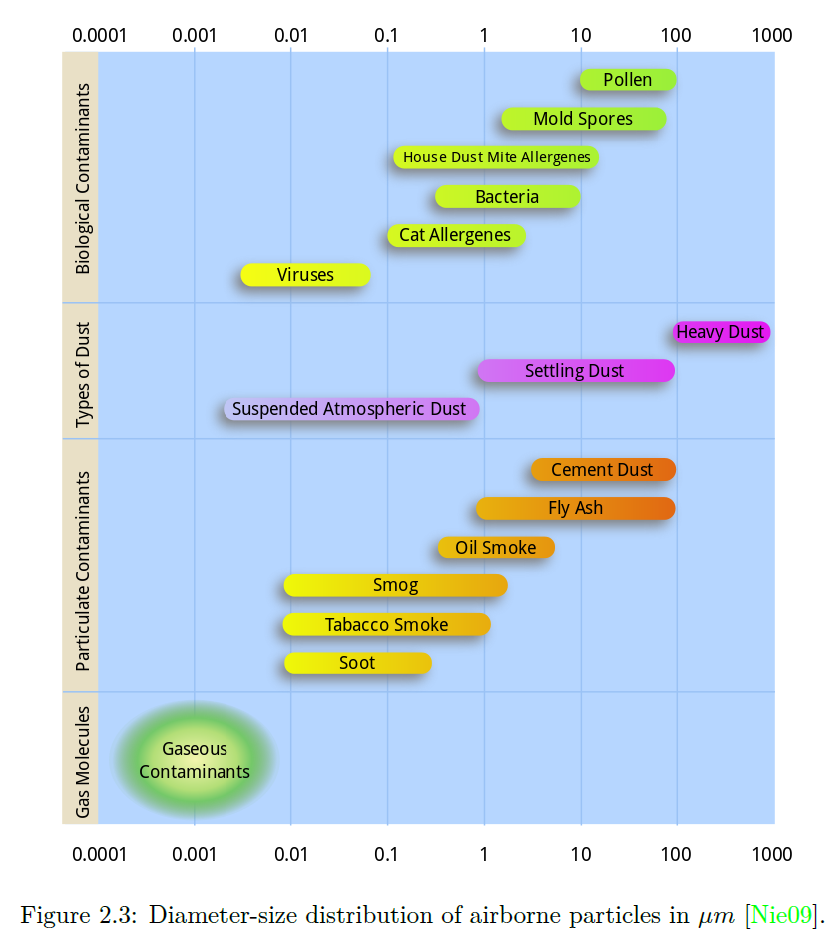
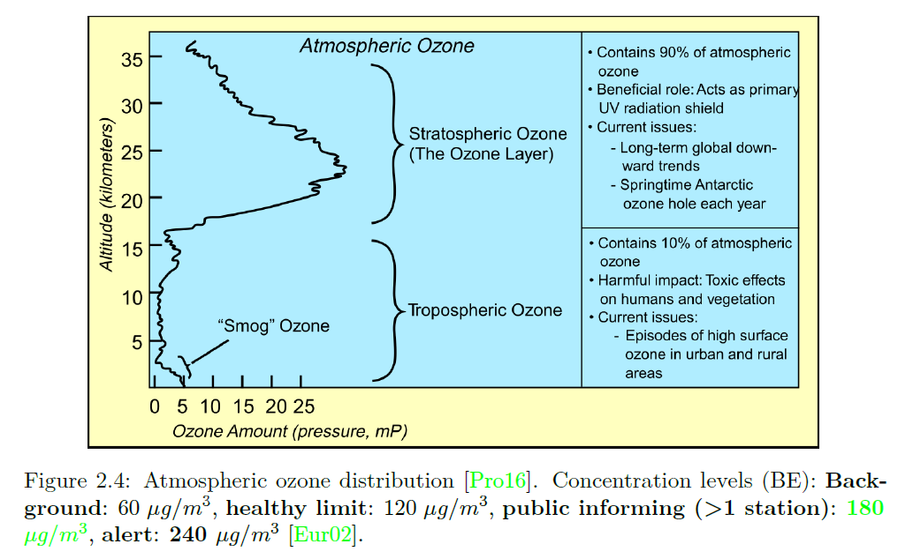
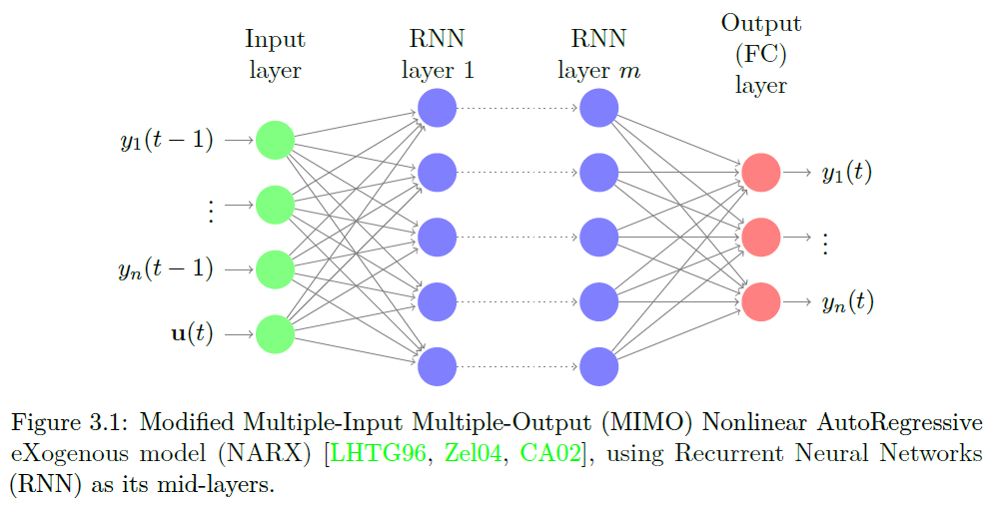
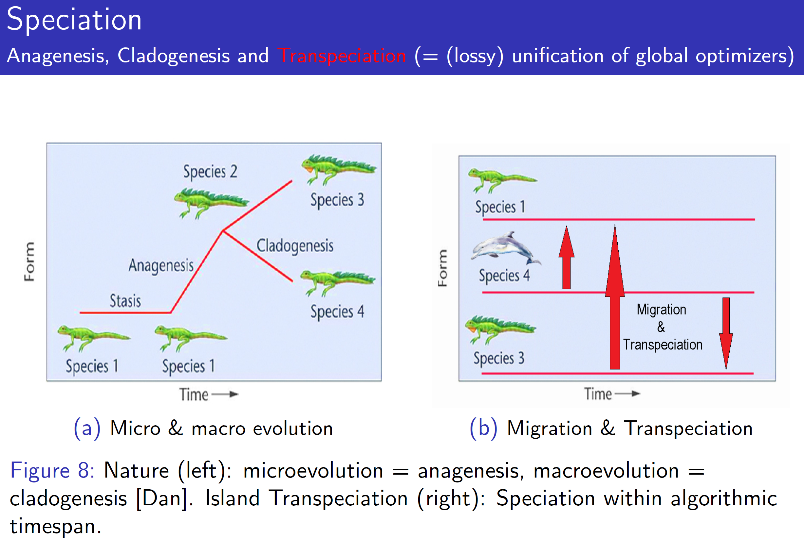
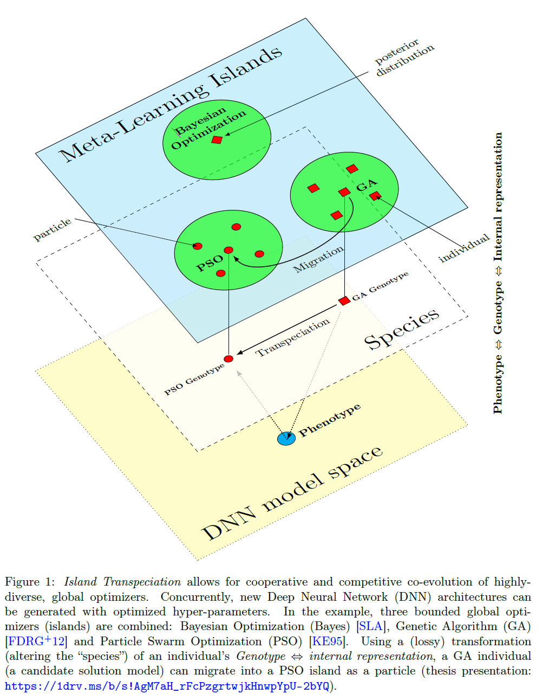
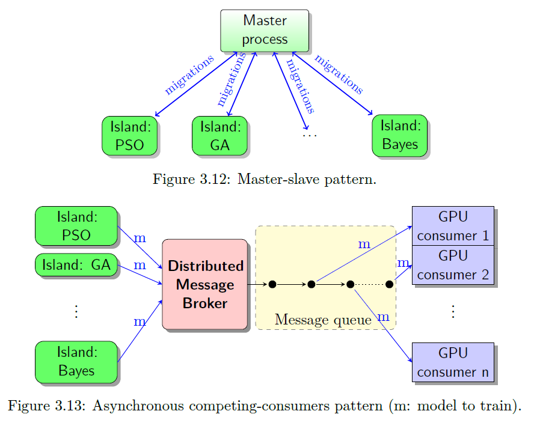
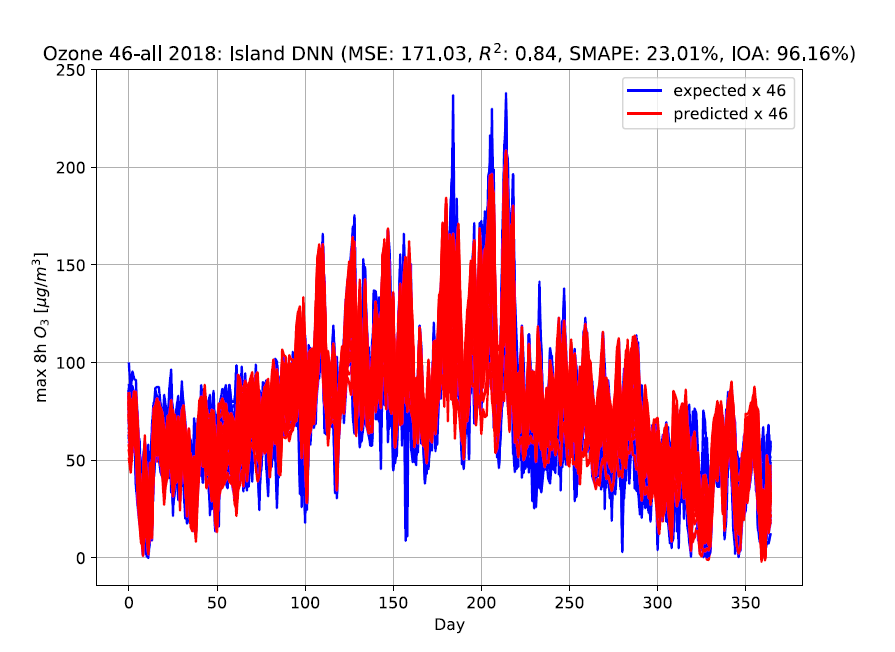
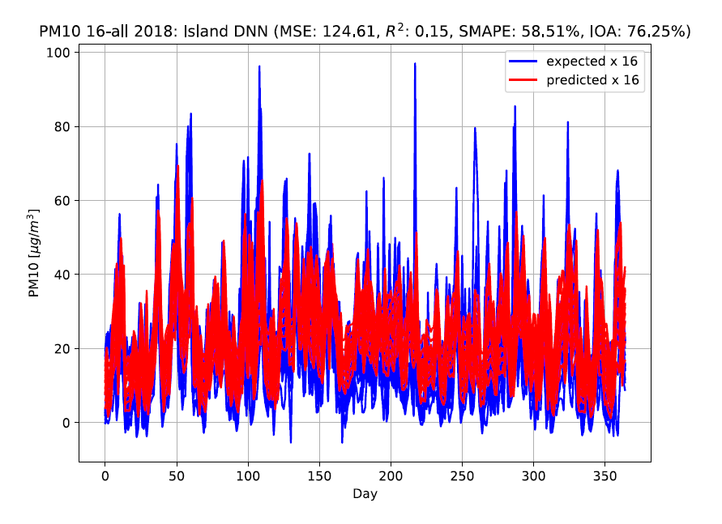

# Island Transpeciation: A Co-Evolutionary Neural Architecture Search, Applied to Country-Scale Air-Quality Forecasting

#### Konstantinos Theodorakos  
*KU Leuven*  
*PhD Researcher in Data Science*  
*Faculty of Engineering Science*  
*Departments of Electrical Engineering ESAT-STADIUS and Computer Science*
*Kasteelpark Arenberg 10*  
*Leuven (Heverlee), Belgium*  
*Emails: madks@hotmail.com Konstantinos.Theodorakos@esat.kuleuven.be*

## How to cite Island Transpeciation
Authors of scientific papers including methods/techniques inspired by Island Transpeciation are encouraged to cite this work as follows:

```xml
@ARTICLE{islandTranspeciation,
  author={Theodorakos, Konstantinos and Mauricio Agudelo, Oscar and Schreurs, Joachim and Suykens, Johan A. K. and De Moor, Bart},
  journal={IEEE Transactions on Evolutionary Computation}, 
  title={Island Transpeciation: A Co-Evolutionary Neural Architecture Search, Applied to Country-Scale Air-Quality Forecasting}, 
  year={2023},
  volume={27},
  number={4},
  pages={878-892},
  doi={10.1109/TEVC.2022.3189500}}
```
See publication at *IEEE Transactions on Evolutionary Computation*: https://ieeexplore.ieee.org/document/9820773

# Abstract

Air pollution is the cause of around 400.000 premature deaths per year and is the largest health risk in Europe [GdLO+18]. The most dangerous pollutants in Europe are Particulate Matter, Nitrogen Oxides and ground-level Ozone (O3).




Multiple-Input Multiple-Output (MIMO), Nonlinear Auto-Regressive exogenous (NARX) Deep Neural Networks (DNN) for air-quality forecasting is an "all-in-one" modelling architecture that can predict next-day ozone and particulate matter concentrations, at a country level. The DNNs we developed, managed to successfully predict one day before, an "inform-public" ozone alert level in Belgium for 2012. For Particulate Matter (PM) 10 μm forecasting, stations with high population densities that are located in industrial regions, are harder to predict. In terms of data, DNN predictions improve with: data standardization, adding weather/atmospheric variables and cyclical calendar features.



To improve the forecasting performance of DNNs, we developed "island transpeciation", a technique that finds architectures and optimizes hyperparameters. 



Island transpeciation is a co-evolutionary meta-learning method, that combines Neural Architecture Search, Neuroevolution and Global/Local optimizers. Island transpeciation can generate more accurate DNN models and architectures than naive variants and with fewer iterations than random search. 
In terms of neural architecture search, highly diverse global optimizers can co-evolve architectures via cooperation and competition. In a few words, island transpeciation utilizes the generalized island model [IZ12] paradigm, to improve overall algorithmic performance.



Iterative hyperparameter optimizers can be parallelized and hybrid DNN accelerator resources can be combined with fault tolerance via distributed control. 



The “survival of the fattest” side-effect of meta-learning (model size versus training speed trade-off) is auto-regulated, via the asynchronous Cellular Automata distributed communication.

# Results

Figure: Next-day, aggregated (country-scale) Ozone predictions for Belgium 2018:


Figure: Next-day, aggregated (country-scale) Particulate Matter 10μm predictions for Belgium 2018:


### Keywords
neural architecture search, deep neural networks, forecasting, air quality, ozone, particulate matter, MIMO, NARX

## Further information

Full thesis text: https://1drv.ms/b/s!AgM7aH_rFcPzgrtlG3u5O2VN9mz8BQ

Thesis presentation:  https://1drv.ms/b/s!AgM7aH_rFcPzgrtwjkHnwpYpU-2bYQ

Thesis submitted for the degree of Master of Science in Artificial Intelligence, option Engineering and Computer Science

Thesis supervisor: Prof. dr. ir. Johan Suykens

Assessors: Prof. dr. Dirk Roose, Prof. dr. Karl Meerbergen

Mentors: Dr. Oscar Mauricio Agudelo,  MSc Joachim Schreur

Ozone Narx DNN
Copyright (c) 2018-2019, Konstantinos Theodorakos (email: madks@hotmail.com).
All rights reserved.

This program is free software; you can redistribute it and/or modify it under the terms of the GNU General Public License as published by the Free Software Foundation; either version 2 of the License, or (at your option) any later version.
This program is distributed in the hope that it will be useful, but WITHOUT ANY WARRANTY; without even the implied warranty of MERCHANTABILITY or FITNESS FOR A PARTICULAR PURPOSE.  See the GNU General Public License for more details.
You should have received a copy of the GNU General Public License along with this program; if not, write to the Free Software Foundation, Inc., 51 Franklin Street, Fifth Floor, Boston, MA  02110-1301, USA.

### REFERENCES

[GdLO+18] Cristina Guerreiro, Frank de Leeuw, Alberto Gonzlez Ortiz, Mar Viana, and Augustin Colette. Air quality in Europe 2018 report. Technical report, 2018.

[Nie09] Mark J. Nieuwenhuijsen. Exposure assessment in occupational and environmental epidemiology. 2009.

[Pro16] Project Science Office. NASA’s Earth Observing System, 2016.

[Eur02] European Commission. Directive 2002/3/EC of the European Parliament and of the council of 12 February 2002 relating to ozone in ambient air. Official Journal of the European Union, 2002.

[LHTG96] Tsungnan Lin, Bill G. Horne, Peter Tio, and C. Lee Giles. Learning long-term dependencies in NARX recurrent neural networks. IEEE Transactions on Neural Networks, 1996.

[Zel04] Albert Van Zelst. MIMO OFDM for Wireless LANs. Geboren te Waalwijk, 2004.

[CA02] J. Connor and L. Atlas. Recurrent neural networks and time series prediction. 2002.

[Dan] Dana Krempels. BIL 160 Evolution and Biodiversity (PRISM), Lecture notes on Macroevolution: The Origin of Species.

[SLA] Jasper Snoek, Hugo Larochelle, and Ryan P Adams. Practical Bayesian Optimization of Machine Learning Algorithms. Technical report.

[FDRG+12] Felix-Antoine Fortin, Franois-Michel De Rainville, Marc-Ande Gardner, Marc Parizeau, and Christian Gagne. DEAP: Evolutionary algorithms made easy. Journal of Machine Learning Research, 2012.

[KE95] J. Kennedy and R. Eberhart. Particle swarm optimization. In Proceedings of ICNN’95 - International Conference on Neural Networks, volume 4, pages 1942–1948. IEEE, 1995.

[IZ12] Izzo, D., Ruciński, M., & Biscani, F. (2012). The generalized Island model. Studies in Computational Intelligence, 415(January 2012), 151–169. https://doi.org/10.1007/978-3-642-28789-3-7
